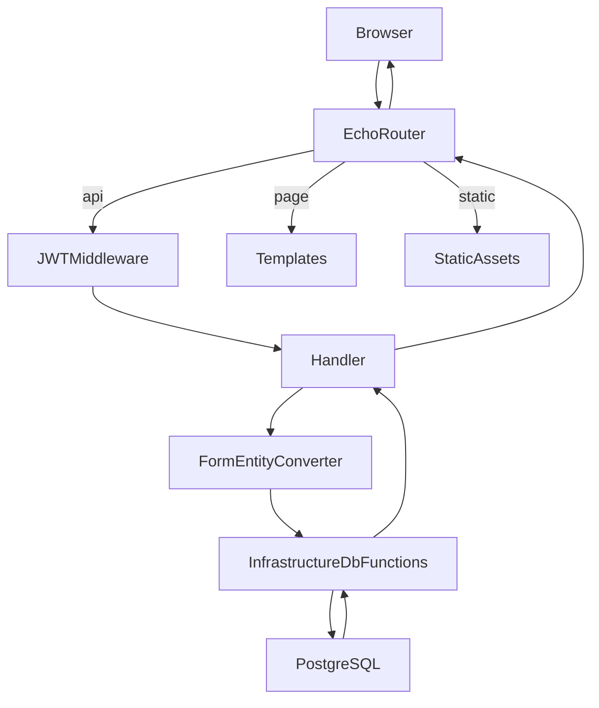
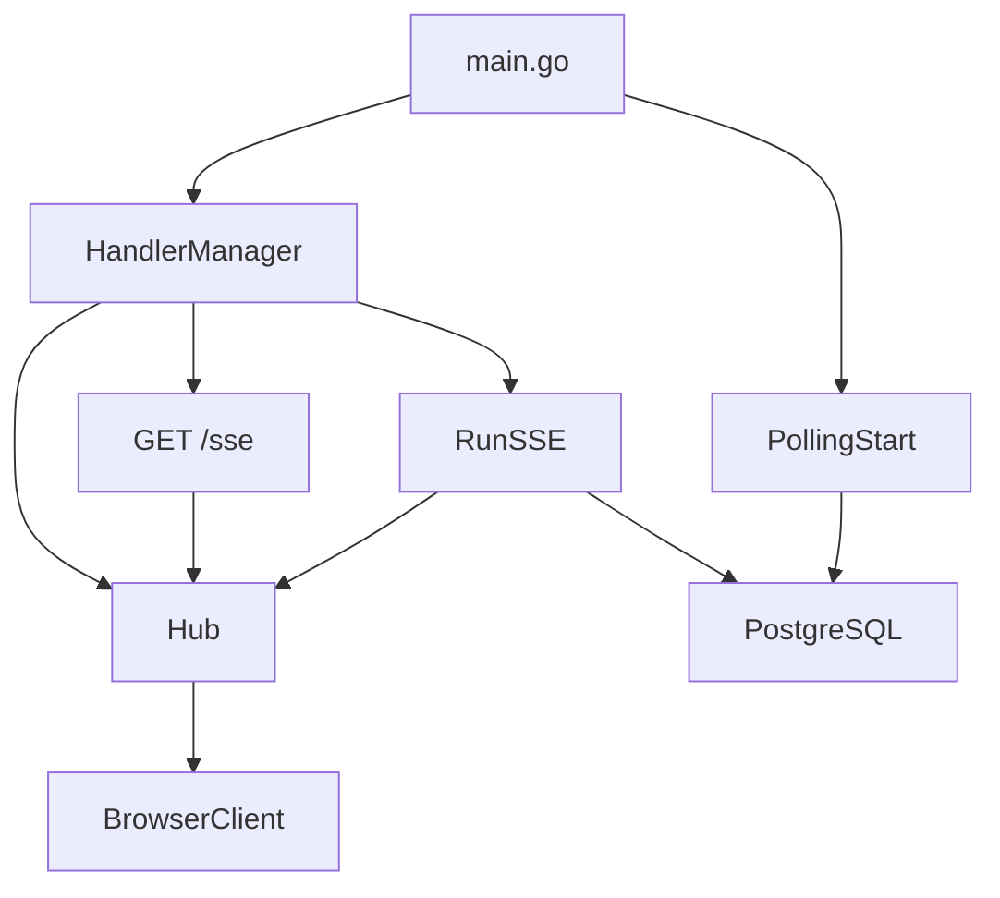

# 設計と構成

## レイヤ構成

このアプリは厳密な層分離よりも、`handler` と `_mac_infrastructure` を中心にしたシンプルな構成です。

- [main.go](../main.go): Echo と DB の初期化、`HandlerManager` の生成、SSE と通知ポーリングの起動
- [handler/handlerManager.go](../handler/handlerManager.go): ルート登録の集約点
- [handler/](../handler/): HTTP ハンドラ、SSE ハンドラ、通知の定期処理
- [_mac_infrastructure/form.go](../_mac_infrastructure/form.go): UI と API の JSON 形
- [_mac_infrastructure/converter.go](../_mac_infrastructure/converter.go): Form と Entity の相互変換
- [_mac_infrastructure/entity.go](../_mac_infrastructure/entity.go): GORM モデル
- [_mac_infrastructure/db.go](../_mac_infrastructure/db.go): DB アクセス、関連更新、取得処理

`internal/` 配下も存在しますが、現時点でアプリの主要フローは `handler` と `_mac_infrastructure` を中心に構成されています。

## ルーティング構成

[handler/handlerManager.go](../handler/handlerManager.go) の `SetupHandlers()` が次の 4 系統をまとめて登録します。

- Auth: [handler/authHandler.go](../handler/authHandler.go)
- Page: [handler/pageHandler.go](../handler/pageHandler.go)
- SSE: [handler/sseHandler.go](../handler/sseHandler.go)
- API: [handler/apiHandler.go](../handler/apiHandler.go)

## リクエスト処理

ページ配信はテンプレート、更新系 API は JSON を `Form` に読み込み、`Entity` へ変換して DB 層に渡します。

## SSE と通知

- [handler/sseHandler.go](../handler/sseHandler.go): `/sse` を公開し、接続クライアントへイベントを送信
- [handler/eventHub.go](../handler/eventHub.go): `question` / `user` / `tag` / `notice` / `time-tick` を定期配信
- [handler/notice.go](../handler/notice.go): 期限が 24 時間以内の質問に対して通知を自動作成

## Form と Entity

`Form` は UI 用の JSON 形で、ID の多くを文字列で持ちます。[`QuestionForm`](../_mac_infrastructure/form.go)、[`UserForm`](../_mac_infrastructure/form.go)、[`TagForm`](../_mac_infrastructure/form.go) などが API の入出力になります。

`Entity` は GORM 用の永続化モデルで、関連も含みます。[`Question`](../_mac_infrastructure/entity.go)、[`Answer`](../_mac_infrastructure/entity.go)、[`Memo`](../_mac_infrastructure/entity.go) などが該当します。

[converter.go](../_mac_infrastructure/converter.go) の役割:

- `QuestionFromEntity` / `QuestionToEntity`
- `UserFromEntity` / `UserToEntityNoRole`
- `TagFromEntity` / `TagToEntity`, `TagToEntityNoRelations`
- ISO 文字列と `time.Time` の変換
- サーバ側での FK 補完や空値の除外

## 更新設計の特徴

- 単一レコード更新は [`UpdateByID`](../_mac_infrastructure/db.go) を使う
- 質問のように複数関連をまとめて扱う更新は [`UpdateQuestionInTransaction`](../_mac_infrastructure/db.go) を使う
- `tag_managers` や `memos` のような NOT NULL FK を持つ子テーブルは、`Association.Replace/Clear` ではなく DELETE + INSERT で同期する

最終更新: 自動生成 2026-04-24
