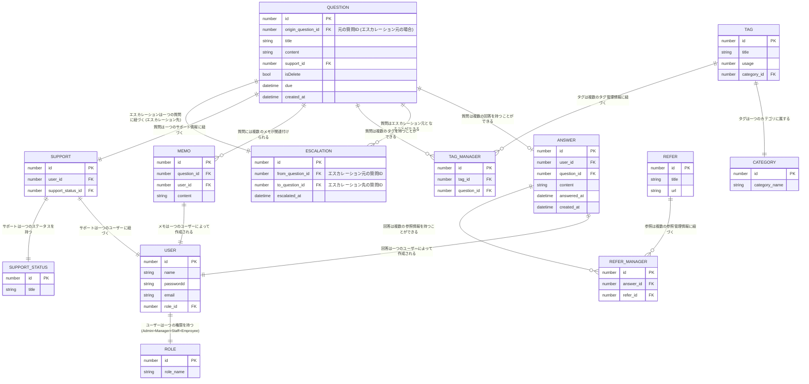

```mermaid
erDiagram
    USER {
        number id PK
        string name
        string passwordd
        string email
        number role_id FK
    }
    USER ||--|| ROLE: "ユーザーは一つの権限を持つ (Admin>Manager>Staff>Emproyee)"

    ROLE {
        number id PK
        string role_name
    }

    QUESTION {
        number id PK
        number origin_question_id FK "元の質問ID (エスカレーション元の場合)"
        string title
        string content
        number support_id FK
        bool isDelete
        datetime due
        datetime created_at
    }
    QUESTION ||--o| ANSWER: "質問は複数の回答を持つことができる"
    QUESTION ||--o{ ESCALATION: "質問はエスカレーション元となることができる"
    QUESTION ||--o{ TAG_MANAGER: "質問は複数のタグを持つことができる"
    QUESTION ||--o{ MEMO: "質問には複数のメモが関連付けられる"
    QUESTION ||--|| SUPPORT: "質問は一つのサポート情報に紐づく"

    ANSWER {
        number id PK
        number user_id FK
        number question_id FK
        string content
        datetime answered_at
        datetime created_at
    }
    ANSWER ||--|| USER: "回答は一つのユーザーによって作成される"
    ANSWER ||--o{ REFER_MANAGER: "回答は複数の参照情報を持つことができる"

    SUPPORT {
        number id PK
        number user_id FK
        number support_status_id FK
    }
    SUPPORT ||--|| USER: "サポートは一つのユーザーに紐づく"
    SUPPORT ||--|| SUPPORT_STATUS: "サポートは一つのステータスを持つ"

    SUPPORT_STATUS {
        number id PK
        string title
    }

    MEMO {
        number id PK
        number question_id FK
        number user_id FK
        string content
    }
    MEMO ||--|| USER: "メモは一つのユーザーによって作成される"

    REFER {
        number id PK
        string title
        string url
    }
    REFER ||--o{ REFER_MANAGER: "参照は複数の参照管理情報に紐づく"

    ESCALATION {
        number id PK
        number from_question_id FK "エスカレーション元の質問ID"
        number to_question_id FK "エスカレーション先の質問ID"
        datetime escalated_at
    }
    ESCALATION ||--|| QUESTION: "エスカレーションは一つの質問に紐づく (エスカレーション先)"

    REFER_MANAGER {
        number id PK
        number answer_id FK
        number refer_id FK
    }

    TAG {
        number id PK
        string title
        number usage
        number category_id FK
    }
    TAG ||--|| CATEGORY: "タグは一つのカテゴリに属する"
    TAG ||--o{ TAG_MANAGER: "タグは複数のタグ管理情報に紐づく"

    TAG_MANAGER {
        number id PK
        number tag_id FK
        number question_id FK
    }

    CATEGORY {
        number id PK
        string category_name
    }
```
