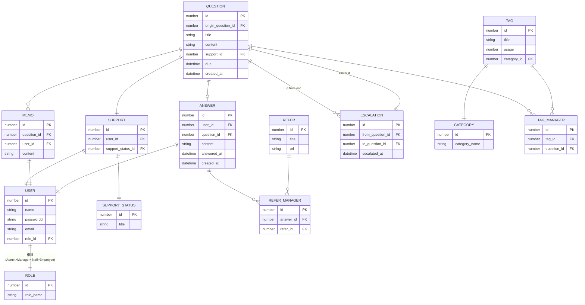

```mermaid
erDiagram
    USER {
        number id PK
        string name
        string passwordd
        string email
        number role_id FK
    }
    USER ||--|| ROLE: "権限(Admin>Manager>Staff>Emproyee)"

    QUESTION {
        number id PK
        number origin_question_id FK
        string title
        string content
        number support_id FK
        datetime due
        datetime created_at
    }

    SUPPORT {
        number id PK
        number user_id FK
        number support_status_id FK
    }
    QUESTION ||--|| SUPPORT: ""
    SUPPORT ||--|| USER: ""
    SUPPORT ||--||SUPPORT_STATUS: ""

    SUPPORT_STATUS {
        number id PK
        string title
    }

    ANSWER {
        number id PK
        number user_id FK
        number question_id FK
        string content
        datetime answered_at
        datetime created_at
    }

    MEMO {
        number id PK
        number question_id FK
        number user_id FK
        string content
    }
    MEMO ||--|| USER: ""

    REFER {
        number id PK
        string title
        string url
    }

    ESCALATION {
        number id PK
        number from_question_id FK
        number to_question_id FK
        datetime escalated_at
    }

    REFER_MANAGER {
        number id PK
        number answer_id FK
        number refer_id FK
    }

    TAG {
        number id PK
        string title
        number usage
        number category_id FK
    }
    TAG ||--|| CATEGORY: ""

    TAG_MANAGER {
        number id PK
        number tag_id FK
        number question_id FK
    }

    CATEGORY {
        number id PK
        string category_name
    }

    ROLE {
        number id PK
        string role_name
    }

    QUESTION ||--o| ANSWER: ""
    QUESTION ||--o{ ESCALATION: "q from esc"
    QUESTION ||--o{ TAG_MANAGER: ""
    QUESTION ||--o{ MEMO: ""

    ESCALATION ||--|| QUESTION: "esc to q"

    ANSWER ||--|| USER: ""
    ANSWER ||--o{ REFER_MANAGER: ""

    REFER ||--o{ REFER_MANAGER: ""
    
    TAG ||--o{ TAG_MANAGER: ""
```