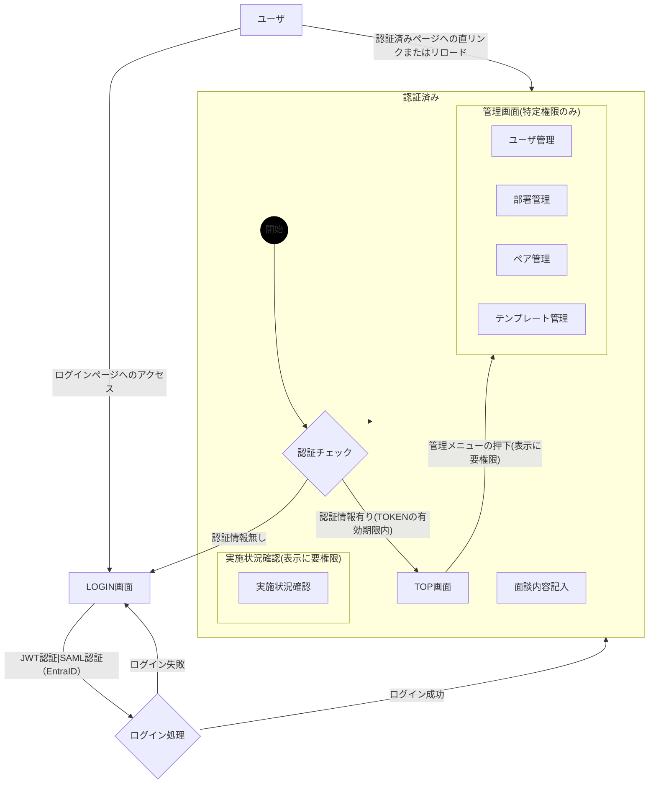

```mermaid
graph TD;

USER[ユーザ]
LOGIN[LOGIN画面]
LOGIN_CK{ログイン処理}

USER-->|ログインページへのアクセス|LOGIN
LOGIN-->|"JWT認証|SAML認証（EntraID）"|LOGIN_CK
LOGIN_CK-->|ログイン成功|AUTHORIZED
LOGIN_CK-->|ログイン失敗|LOGIN

USER-->|認証済みページへの直リンクまたはリロード|AUTHORIZED
AUTHORIZED-->AUTHORIZED_CK
AUTHORIZED_CK-->|"認証情報有り(TOKENの有効期限内)"|TOP
AUTHORIZED_CK-->|"認証情報無し"|LOGIN

subgraph AUTHORIZED[認証済み]
     %% 開始ノードの定義
    START((開始)):::blackDot-->AUTHORIZED_CK
    %% 黒塗りのスタイル設定
    classDef blackDot fill:#000,stroke:#000,stroke-width:2px;

    direction TB;
    TOP[TOP画面]
    AUTHORIZED_CK{認証チェック}

    %% 面談内容
    ANSWER[面談内容記入]

    %% 実施状況確認
    subgraph IMPLEMENTATION_PROGRESS["実施状況確認(表示に要権限)"]
        IMPL_PROG[実施状況確認]
    end

    %% 管理メニュー
    TOP-->|"管理メニューの押下(表示に要権限)"|MANAGEMENT
    subgraph MANAGEMENT["管理画面(特定権限のみ)"]
        MNG_USER[ユーザ管理]
        MNG_DEPARTMENT[部署管理]
        MNG_PEER[ペア管理]
        MNG_TEMPLATE[テンプレート管理]
    end
end
```