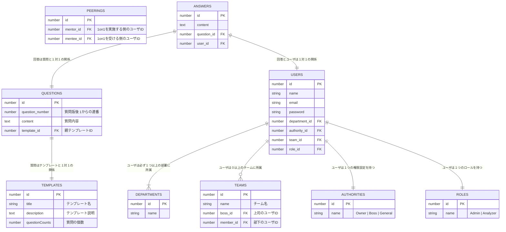

```mermaid
erDiagram
%% 全テーブルはcreated_at, updated_at, deleted_atを持つものとする

USERS {
    number id PK
    string name
    string email
    string password

    number department_id FK
    %% 権限ID、Ownerは全てのログへのアクセス、BossはDepartment以下またはBossRelations参照、GeneralはPeeringのリレーション参照
    number authority_id FK
    number team_id FK
    number role_id FK
}
%% 部長職を兼任しているケースをカバーするためHasManyの関係
USERS ||--|{ DEPARTMENTS: "ユーザは必ず１つ以上の部署に所属"
USERS ||--o{ TEAMS: "ユーザは０以上のチームに所属"
USERS ||--|| AUTHORITIES: "ユーザは１つの権限設定を持つ"
USERS ||--|| ROLES: "ユーザは１つのロールを持つ"

%% 部署名を設定するためのテーブル
DEPARTMENTS {
    number id PK
    string name
}

%% 1on1の関係を紐づけるためのテーブル
%% Mentorとしては０以上の関係、Menteeとしては１対１の関係
PEERINGS {
    number id PK
    number mentor_id FK "1on1を実施する側のユーザID"
    number mentee_id FK "1on1を受ける側のユーザID"
}

%% チーム単位の関係を作成するテーブル
%% SeniorManagerの下に複数のMemberユーザが所属する
TEAMS {
    number id PK
    string name "チーム名"
    number boss_id FK "上司のユーザID"
    number member_id FK "部下のユーザID"
}

AUTHORITIES {
    number id PK
    string name "Owner | Boss | General"
}

ROLES {
    number id PK
    string name "Admin | Analyzer"
}

%% 1on1のテンプレートを表すテーブル
%% 
TEMPLATES {
    number id PK
    string title "テンプレート名"
    text description "テンプレート説明"
    number questionCounts "質問の個数"
}

QUESTIONS {
    number id PK
    number question_number "質問版後 1からの連番"
    text content "質問内容"

    number template_id FK "親テンプレートID"
}
QUESTIONS ||--|| TEMPLATES: "質問はテンプレートと１対１の関係"

ANSWERS {
    number id PK
    text content

    number question_id FK
    number user_id FK
}
ANSWERS ||--|| QUESTIONS: "回答は質問と１対１の関係"
ANSWERS ||--|| USERS: "回答とユーザは１対１の関係"
```