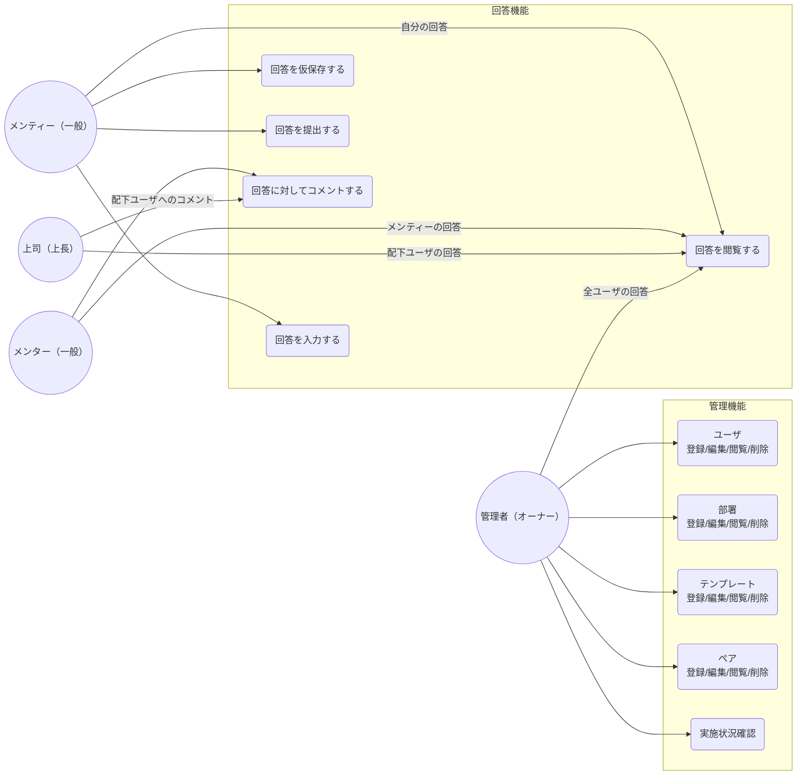

## HR Assist（本リポ mock5）の認可メモ

- ログイン後の JWT は typed claims（`user_id` / `email` / `role_id` / `name`（ロール名））で発行する。
- mock5 の SSR では `roles.id` が **1=Admin**、**2=Manager** のときだけユーザー管理ビュー・招待/編集モーダルを出す（それ以外は Staff 等）。
- mock5 ではタグ/ユーザー/詳細の一部 UI 向けに、DB マスタの **roles / categories / support_statuses** を SSR で渡し、フロントのハードコードを減らす。
